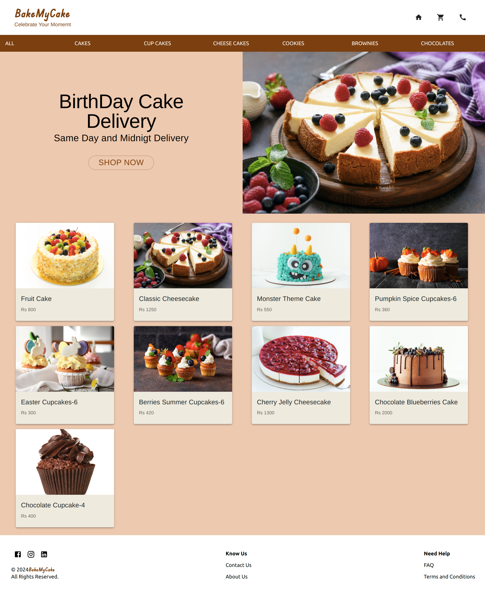
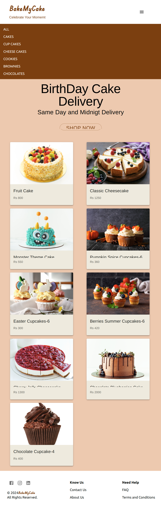
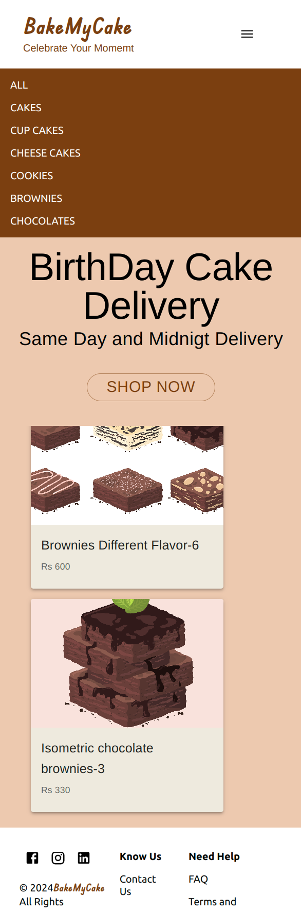
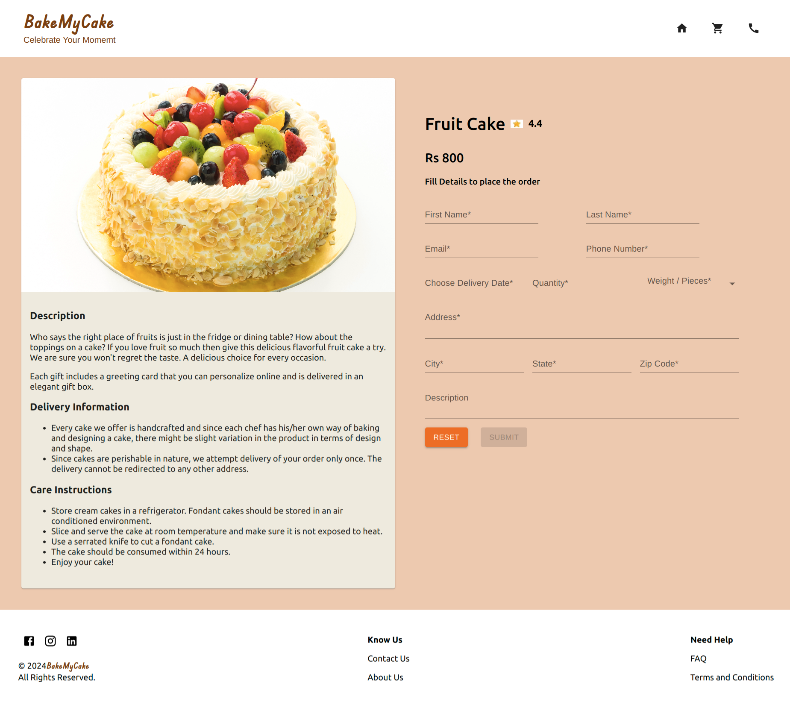
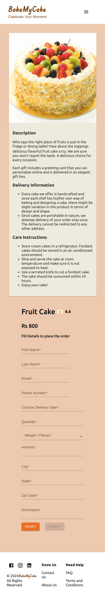
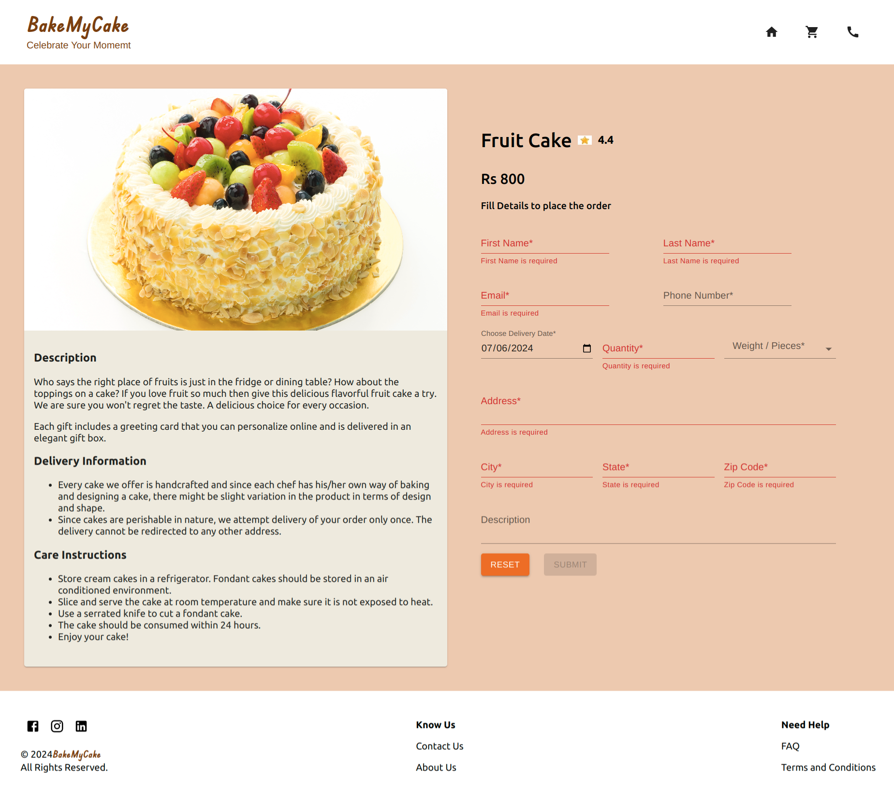
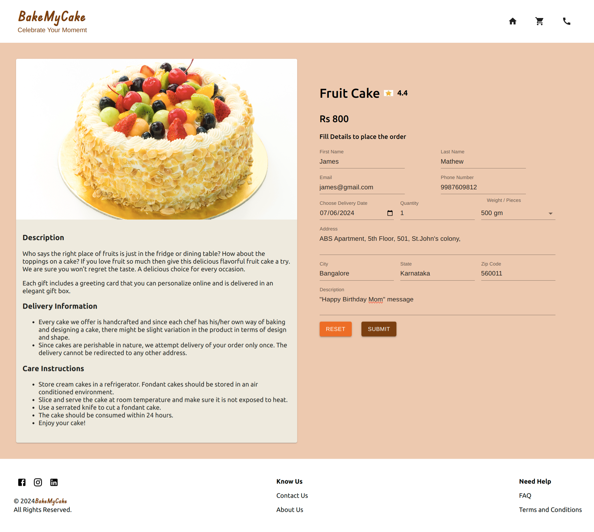

## Course End Project: Bake My Cake - Phase II

### Context

Cakes, cookies and brownies are all time favorites of young and old. No celebration is complete without these delicacies. The cake shops have started offering options to the customers to bake cakes as per their needs.

In addition, taking the advantage of widely used digital platform, the cake outlets offer options to customers to place their orders online.

This is a win-win situation for both the outlet as well as its customers. The outlets are able to reach to larger audience and the customers are able to enjoy the delicacies prepared by the popular outlet, served at their doorstep.

Bake My cake - React application is developed in two phases.​

In the first phase, the application allowed the customers to view a list of cakes, cookies, or brownies available in the cake shop.​ The delicacies are displayed with attractive images and crisp details like name and price. ​

The app also allowed to search and filter the items by the user’s preference for a quick selection. ​Unit test cases for each component are created to make the app robust.

### Problem Statement

- In the second phase, modify the existing application developed in the first phase by implementing the following tasks.​
- Enhance the appearance of the existing application by using Material design systems for pleasing aesthetics and rich user experience.​
- The app should allow the users to select a particular item of their choice, that displays the selected items with detailed description. ​
- It should also allow the user to place the order for the selected item by providing the required order details.

### Tasks

#### Task 1: Enhance the Existing Web Page – Home View​

- Modify the Header and Footer of the web page that defines the website logo and copyright details using Material Design system and Material Icons.​
- Modify the hero or the main section of the web page that displays the images of cakes, cookies, and brownies using Material components like Grid, Typography, Card, Button, etc.​
  - The data must be fetched using json-server.​
- The app should also allow users to filter these items by their preference.​
  - Filtering allows user to filter items by category.​
- Use Material Theme and Theme Provider to style the application components that provide a consistent look and feel to the app.​

Note: Below is the preview of the React application – Bake My Cake's Home view. This is only for your reference. You can design the layout and color palettes according to your choice.​

**Bake My Cake - Home View - Desktop**



**Bake My Cake - Home View - Tab**



**Bake My Cake - Home View - Mobile**



#### Task 2: Design the Order View ​

- The user will be navigated to the order view once he selects a particular item on the home view.​
- The order view should display the details of the item selected.​
- This view should also allow users to provide the details required for placing the order for the selected item.​
- The details should include the item name as well as the customer details.
  - Design the order form using Material components. Use React Hook Form to validate the form fields and to handle form submission.  ​
- The details should be persisted, and the customer should be acknowledged after the order is successfully placed.(Hint: Use Material snackbar)​
- After successful order placement, the customer should be navigated to the home view.​

Note: Below is the preview of the React application – Bake My Cake's Order view. This is only for your reference. You can design the layout and color palettes according to your choice.​

**Bake My Cake - Order View - Desktop**



**Bake My Cake - Order View - Mobile**



#### Task 3: Order Form Fields and Validtaions

| Form Field    | Validation                                                                           |
| ------------- | ------------------------------------------------------------------------------------ |
| First Name    | Should not be blank ​                                                                |
| Last Name     | Should not be blank​                                                                 |
| Email         | Should not be left blank and should accept a valid email id                          |
| Phone         | Should accept only a 10-digit number starting with 7, 8, or 9                        |
| Delivery Date | Should be greater than or equals to today's date                                     |
| Quantity      | Should be >=1 and <=20                                                               |
| Weight/Pieces | Should have one of the following values: 2kg, 1kg, 500gm, 250gm, 6 pieces, 4 pieces​ |
| Address       | Should not be blank                                                                  |
| City          | Should not be blank                                                                  |
| State         | Should not be blank                                                                  |
| Zip code      | Should not be blank and should have 6 digits                                         |

**Bake My Cake - Order Form with Invalid Data**



**Bake My Cake - Order Form with Invalid Data**


**Bake My Cake - Order Form with Valid Data**



#### Task 4: Enable Routing to the Application

Define routes in the application that fulfills the following requirements.​
- Route that navigates to the home view for the path `/home`.​
- Route that navigates to the order view for the path `/cakes/{id}`. ​
  - It should then fetch the cake by this id and display its details with an order form.​
- Route that navigates to the home view(default) for the path `/`.​
- Wild card route to handle "page not found" error.

#### Text Used in the Project

```
 Every cake we offer is handcrafted and since each chef has  his/her own way of baking and designing a cake, there might be slight variation in the product in terms of design and shape.

 Since cakes are perishable in nature, we attempt delivery of your order only once. The delivery cannot be redirected to other address.

Store cream cakes in a refrigerator. Fondant cakes should be stored in an air conditioned environment.

Slice and serve the cake at room temperature and make sure it is not exposed to heat.
Use a serrated knife to cut a fondant cake.
The cake should be consumed within 24 hours.
Enjoy your cake!

```


#### Instructions for the Project

- Fork the boilerplate into your own workspace.​​​​​​
- Clone the forked boilerplate into your local system.
- List of cake data and empty order data available inside `data/cakes.json` file.
- Cake related images are available in the `cakes` folder of the boilerplate.​
- Copy and paste the React application developed in the previous course – `Develop Single Page application using React` into the root folder of the boilerplate.​
- Modify and develop the solution of the project for the requirements specified. 
- ​Test the outcome and ensure it fulfills the stated requirements.​​
